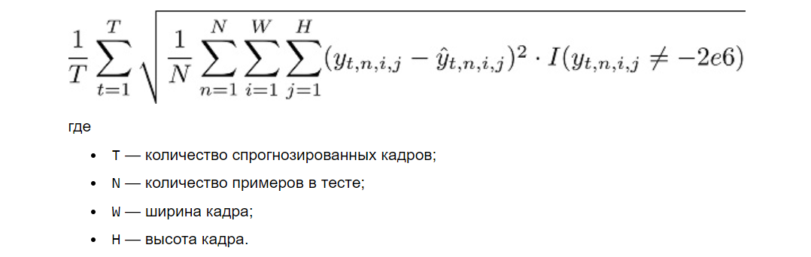

# Yandex-Cup-2023-ML-Nowcasting
Наукастинг - прогнозирование объёма осадков в конкретное время и в конкретном месте.
  
# Nowcasting
## Описание задачи

  
В альтернативном Древнем Риме только у императора и его приближённых есть доступ к современным технологиям. Благодаря этому люди считают Сикстиниана Апреля посланником богов, который управляет погодой или как минимум видит будущее.
  
Ежегодно в городе проводится масштабный пленэр в честь Непобедимого Солнца — сотни горожан собираются на стенах Колизея, чтобы запечатлеть закат с помощью холста и красок. Каждое утро в день события Сикстиниан предсказывает, будет ли дождь на закате или нет.
  
В этот раз успех предсказания под угрозой. Новенький iCeasar, на котором установлена модель, прогнозирующая осадки, завис. На внешнем SSD остался только датасет одного метеорологического радиолокатора, который регистрирует наличие влаги в атмосфере на большой площади.
  
**Задача** - подготовить модель, которая сможет прогнозировать объём осадков в конкретное время и в конкретном месте. Сохраните веру в Сикстиниана Апреля, помогите избежать заката Римской империи.
   
Данные измерений метеорологического радара предоставлены Яндекс Погодой и ФГБУ ЦАО.
  
Данные и код бейзлайна доступны по ссылке: https://disk.yandex.ru/d/bLIfjz-8n5InYA
  
## Данные
В папке train лежат hdf5-файлы с измерениями одного из российских метеорологических радаров за 2021 год с разбивкой по месяцам. В файлах для каждого момента времени (шаг 10 минут) хранятся данные про интенсивность осадков, отражаемость облаков и их радиальную скорость, погодные явления.
  
Обученную модель надо будет проверить на данных из файла 2022-test-public.hdf5, в котором хранятся часть измерений с метеорологического радара за 2022 год.
  
Пример с визуализацией данных находится в файле Jupyter Notebook draw-samples.ipynb.
  
### Общая информация про формат данных
Радар делает измерения каждые 10 минут с пространственным разрешением 2 км и возвращает изображение с несколькими каналами. Таким образом, каждый пиксель изображения соответствует квадрату 2х2 км с данными различных измерений атмосферы по высоте.
  
Есть два спец. кода:
- 2e6 — нет данных измерений в точке
- 1e6 — нет каких-либо погодных явлений (например, нет осадков для поля intensity)
  
### Интенсивность осадков
Интенсивность осадков в мм/ч — величина, которую требуется прогнозировать. Рассчитывается по формуле Маршала-Палмера [1] из отражаемости, которая описана в следующем разделе. Показывает сколько выпало бы осадков в мм, если бы осадки шли с такой интенсивностью целый час.
  
### Отражаемость
Отражаемость — величина, измеряемая радаром. Значение скоррелировано с количеством влаги в атмосфере в некоторой точке. Измерения происходят на 10 уровнях высоты от 1км до 10 км с шагом 1 км и аппроксимируются на полный круг измерения радара.
  
### Радиальная скорость
Радиальная скорость — ещё одна величина, измеряемая радаром в м/с на10 уровнях высоты. По пространственной форме соответствует отражаемости. В отличие от отражаемости значения не апроксимируются на полный круг радара, а остаются как есть.
  
### Погодные явления
Расчётные значения погодных явлений на полном круге радара, которые могут принимать следующие значения:
<ol start="0">
  <li>Нет облачности</li>
  <li>Обл. в ср. яр.</li>
  <li>Слоист. обл.</li>
  <li>Осадки слабые</li>
  <li>Осадки умеренные</li>
  <li>Осадки сильные</li>
  <li>Кучевая облачность</li>
  <li>Ливень слабый</li>
  <li>Ливень умеренный</li>
  <li>Ливень сильный</li>
  <li>Гроза, вероятность 30-70%</li>
  <li>Гроза, вероятность 70-90%</li>
  <li>Гроза, вероятность > 90%</li>
  <li>Град слабый</li>
  <li>Град умеренный</li>
  <li>Град сильный</li>
  <li>Шквал слабый</li>
  <li>Шквал умеренный</li>
  <li>Шквал сильный</li>
  <li>Смерч</li>
</ol>
  
## Код
В папке sources лежат три файла:
- main.py — файл для запуска обучения и теста с некоторой моделью
- datasets.py — класс для чтения данных радара, в пригодном для PyTorch формата
- models.py — две бейзлайновых модели
    - PersistantModel— модель, которая считает, что в ближайшие два часа осадки будут как в последние 10 минут
    - ConvLSTMModel — простая нейронная модель на базе ConvLSTM [2]
  
Пример запуска:  
$ python ./main.py --model persistant

## Метрика
В задаче наукастинга осадков необходимо минимизировать отклонение спрогнозированных мм от истинного. За основу берётся метрика RMSE [3], но с небольшими изменениями. Финальная формула выглядит так:  

  
Функция evaluate_on_val в файле main.py содержит код для расчёта метрики.
  
## Ссылки
[1] https://ru.wikipedia.org/wiki/Радиолокационная_отражаемость
  
[2] https://arxiv.org/abs/1506.04214
  
[3] https://en.wikipedia.org/wiki/Root-mean-square_deviation